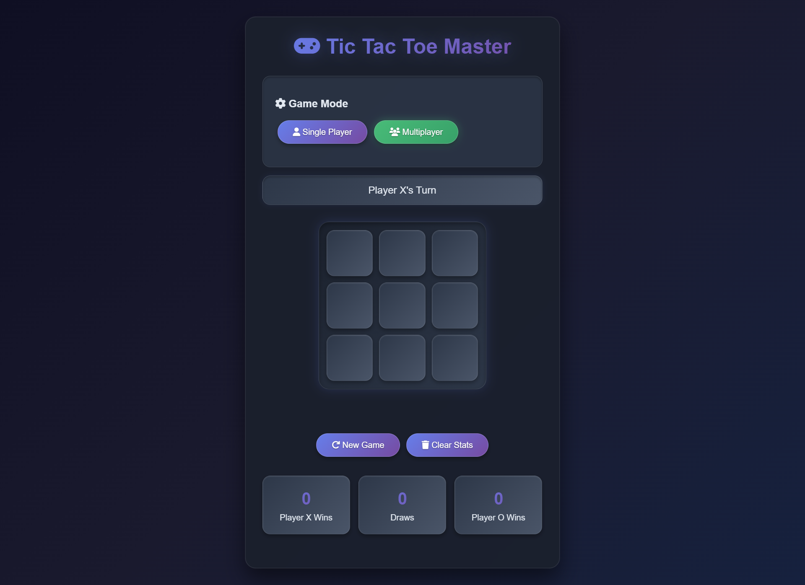
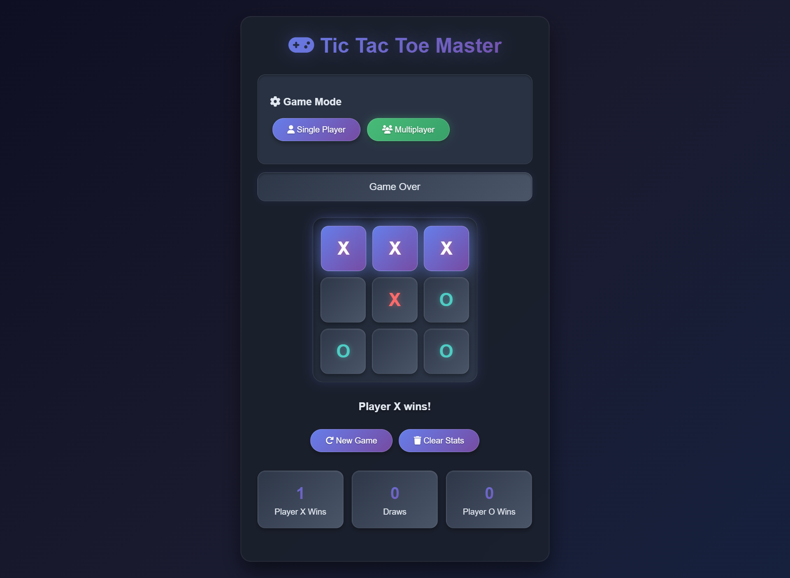

# 🎮 Tic Tac Toe Master  

## 📌 Introduction  
Tic Tac Toe Master is a modern and interactive implementation of the classic Tic Tac Toe game.  
Built with **HTML, CSS, JavaScript, Bootstrap 5, and jQuery**, it comes with a sleek neon-glass UI, multiple game modes, AI difficulty levels, and real-time statistics tracking.  

---

## 📷 Screenshots  
  
  

---

## ✨ Features  
- 🎨 Beautiful glassmorphism-inspired design with animations  
- 🧑‍🤝‍🧑 **Multiplayer Mode** (play with a friend locally)  
- 🤖 **Single Player Mode** with 3 AI difficulty levels:  
  - Easy (random moves)  
  - Medium (balanced logic)  
  - Hard (unbeatable AI)  
- 🏆 Win, Draw, and Loss statistics tracking  
- 🔄 New Game and Clear Stats buttons  
- 💡 Highlights winning moves with animations  
- 📱 Fully responsive design  

---

## 🎮 How to Play  
1. **Select Game Mode**:  
   - Single Player (play against AI)  
   - Multiplayer (play with a friend on the same device)  

2. **If Single Player Mode is selected**:  
   - Choose AI difficulty: Easy, Medium, or Hard.  

3. **Gameplay**:  
   - Player **X** always goes first.  
   - Click on any empty cell to place your mark.  
   - In single-player mode, AI automatically makes its move.  

4. **Winning the Game**:  
   - Get **3 marks in a row** (horizontally, vertically, or diagonally).  
   - If all cells are filled without a winner, it’s a **Draw**.  

5. **Controls**:  
   - 🔄 *New Game*: Reset the board and play again.  
   - 🗑️ *Clear Stats*: Reset win/draw counters.  

---
